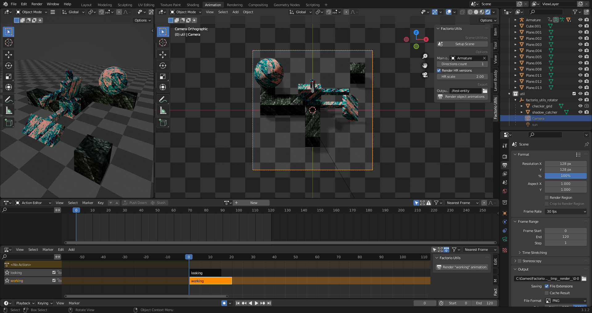
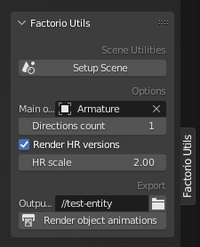
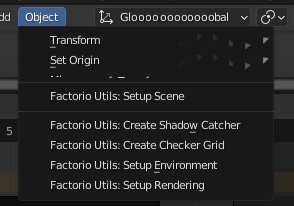
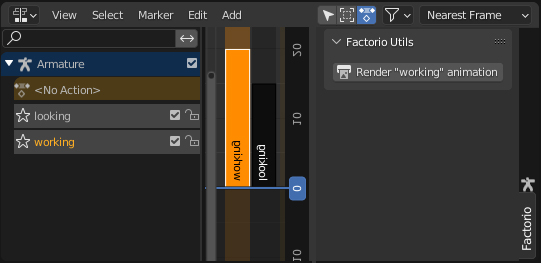
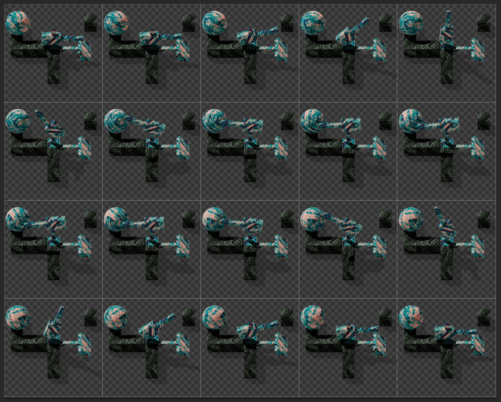
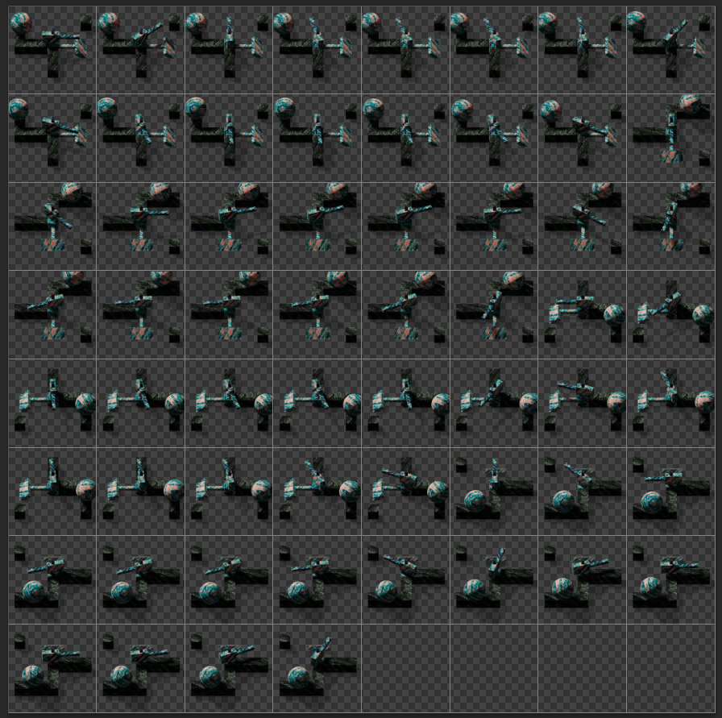
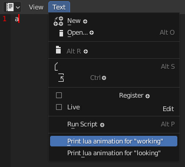
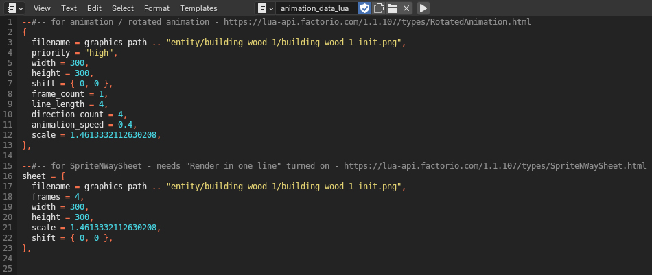

# Factorio Utils v0.8

A small addon for *Blender* that simplifies the creation of graphics for the game *Factorio*.

## Features
* Quick scene setup:
  * Shadow catcher.
  * Game tiles grid.
  * Camera and lighting setup.
* Rendering animations (nla tracks) into spritesheets, in different directions.
* Generation of block of lua code with entity animation data.

## Installation
* Download repo as zip and install it into blender
* **OR** clone repo into `~/AppData/Blender Foundation/Blender/version/scripts/addons/`
* Activate it in preferences

## Controls places

just screenshot

* **3D View side panel**
    

  * **Setup Scene** - Executes all scene setup operators that can be found in the **Object** tab:  
  (rows under "Setup Scene"): 

  * **Options**
    * **Main object** - The object whose animations are being rendered.
    * **Directions count** - The number of directions in which the object will be rendered.
    * **Render HR versions** - Render high resolution versions, whose size is **HR scale** times larger.

  * **Export**
    * **Output file** - Path to the folder and name of the future spritesheet.
    * **Render object animations** - render all object animations into spritesheets, as if they individually rendered here, with this button  
    (In the **NLA Editor** side bar):
      

  
    
    Render examples:

    

    
    
    

* **Text Editor > Text menu**
  

  Here you can generate extremply simple animation data for some entity registration lua code.  
  What it looks like:
  

  
**checking in game**

## Ideas
* Maybe should be added the ablility to define *boxes* properties like *"collision_box"*, *"selection_box"*, *"drawing_box"*, by changing sizes of some planes. That would be cool.